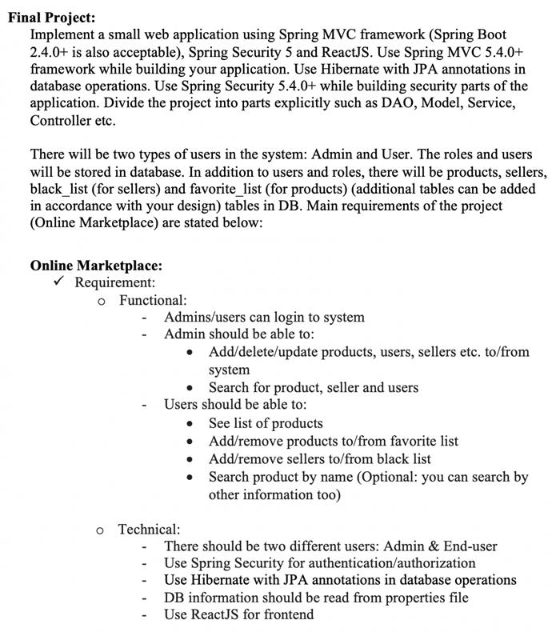

# Online Marketplace
## Project Description
This is an example project which i made during my java summer school internship at [obss](https://obss.com.tr/). 

## Project requirements

## Project Installation
### Requirements
* Java 16
* Maven 3.8.2+
* MySql 8+

### Installation
1. Clone the repository 
	
	`git clone https://github.com/metetik/online-marketplace.git`
2. Create database
	1. Open mysql console
	2. Copy-paste sql_spripts.sql
3. Run backend
	`cd backend`
	`mvn spring_boot:run`
4. Run frontend
	`cd frontend`
	`npm install`
	`npm start`

### Default user credentials
* admin : admin
* user : pass
  
### Video

